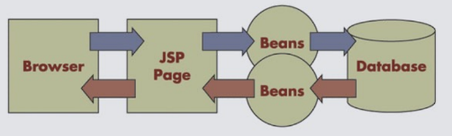
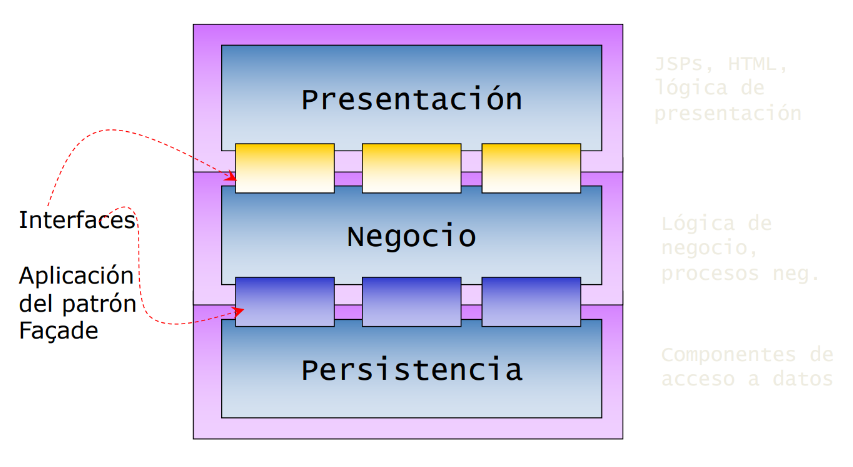
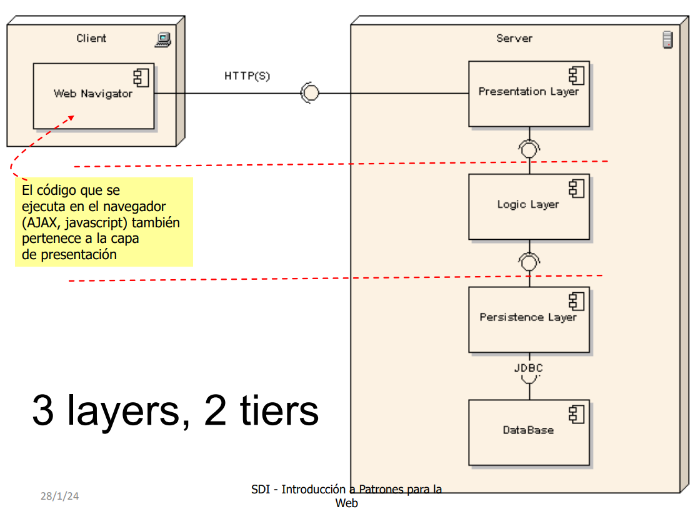

# SDI

- [SDI](#sdi)
  - [Plataformas Java](#plataformas-java)
- [Tema 1 - JEE y Patrones](#tema-1---jee-y-patrones)
  - [Arquitectura Web Básica](#arquitectura-web-básica)
  - [Servlets](#servlets)
  - [Contenedor de servlets/Web container](#contenedor-de-servletsweb-container)
  - [Ciclo de vida](#ciclo-de-vida)
  - [Métodos doGet y doPost](#métodos-doget-y-dopost)
  - [Registro de un servlet](#registro-de-un-servlet)
  - [JSP](#jsp)
  - [Introducción a Patrones](#introducción-a-patrones)
- [Spring Boot](#spring-boot)
  - [Framework Spring](#framework-spring)
  - [Maven](#maven)
  - [Familias de errores http](#familias-de-errores-http)


| Criterios de calificación | Porcentaje    |
| -                         | -             |
| Teoría                    | 40 %          |
| Práctica                  | 60%           |

Sistemas Distribuidos e Internet es una asignatura enfocada en el desarrollo software avanzado, a través de técnicas clásicas y/o ágiles como pueden ser JEE, Spring Boot, Selenium, NodeJs o servicios REST/SOAP, a parte del uso de patrones de diseño en los que se profundizarán más adelante.

| Información general sobre la asignatura                           |
| -                                                                 |
| CV: https://www.campusvirtual.uniovi.es/course/view.php?id=1313   |

En la sesión de presentación del laboratorio, se destacan las siguientes anotaciones importantes:
- Habrá COMMITS semanales a realizar con un id de usuario asignado en el CV
- Habrá ejercicios complementarios en el aula de prácticas
- Se requiere un equipo de 3 a 5 personas para el trabajo en grupo
- Se harán varios repositorios a lo largo de esta asignatura:
  - sdi-2324-509-lab-y.git (jee, spring, nodejs)
  - sdi-2324-509-entrega-sdi1.git (spring)
  - sdi-2324-509-entrega-sdi2.git (node.Js + servicios web)
- Cada repo lab incluirá una etiqueta al realizar cada práctica (ej. “sdi-spring-p1")
- Agregar como colaborador para cada repo a “sdigithubuniovi”

Requisitos para eludir la prueba de autoría:
- Mínima de 4 parcial de teoría
- Mínima de 5 nota individual de las entregas prácticas
- 90% de los commits a tiempo
- Realizar el 50% de los ejercicios adicionales de clase

Revisar 00 SDI-Presentación.pdf para más información.

## Plataformas Java

| Plataformas Java          | Características   |
| -                         | -                 |
| Java Standard Edition     | - Para applets    |
|                           | - VM              |
|                           | - Desarrollo y despliegue de aplicaciones Java en escritorios y servidores |
|                           | - Interfaz de usuario rica, rendimiento, versatilidad, portabilidad y seguridad |
| Java Enterprise Edition   | - Se apoya en SE 
|                           | - Servlets, JSP, JSF, Beans
|                           | - Estándar en software empresarial impulsado por la comunidad <br> - Desarrollo de aplicaciones distribuidas y servicios web |
| Java Micro Edition        | - Proporciona un entorno robusto y flexible para aplicaciones en dispositivos móviles y empotrados
|                           | - Incluye perfiles para dispositivos móviles y televisores |
| JavaFX Script             | - Lenguaje de scripting para JavaFX <br> - Desarrollo de interfaces de usuario ricas para aplicaciones de escritorio, móviles, TV y web |

# Tema 1 - JEE y Patrones

## Arquitectura Web Básica

Un cliente (Navegador) envía una petición de un recurso (URL) a un servidor (Servidor HTTP) y éste le responde vía HTTP

Cuando el navegador solicita una página web, recibe la página y desencadena una petición para cada uno de los
recursos asociados a la misma.

## Servlets

Un servlet es una clase Java que hereda de la clase JEE HTTPServlet y que:

- Acepta peticiones de cualquier método HTTP (get, post, put, delete, head, trace, …)
- Responde también usando el protocolo HTTP
- Se ejecuta dentro de un contenedor de Servlets que a su vez está dentro de un servidor de aplicaciones JEE

## Contenedor de servlets/Web container

- Un contenedor define un ambiente estandarizado de ejecución que provee servicios
específicos a los servlets. Por ejemplo, dan servicio a las peticiones de los clientes, realizando
un procesamiento y devolviendo el resultado
- Los servlets tienen que cumplir un contrato con el contenedor para obtener sus servicios.
- Los contratos son interfaces Java.Por ejemplo, la interfaz Servlet.

## Ciclo de vida

**INICIALIZACIÓN**: Una única llamada al metodo “init” por parte del contenedor de servlets
public void init(ServletConfig config) throws ServletException. Se pueden recoger unos
parametros concretos con “getInitParameter” de “ServletConfig”. Estos parámetros se
especifican en el descriptor de despliegue de la aplicación: web.xml
**PETICIONES**: Primera petición a init se ejecuta en un thread que invoca a service. El resto de
peticiones se invocan en un nuevo hilo mapeado sobre service
**DESTRUCCIÓN**: Cuando todas las llamadas desde el cliente cesen o un temporizador del
servidor así lo indique. Se deben liberar recursos retenidos desde init() public void destroy()

## Métodos doGet y doPost
Son llamados desde el método service(). Reciben interfaces instanciada:

```java
protected void doGet(HttpServletRequest req, HttpServletResponse resp) 
    throws ServletException, IOException {
        . . .
}
protected void doPost(HttpServletRequest req, HttpServletResponse resp) 
    throws ServletException, IOException {
        . . .
}
```

## Registro de un servlet

**Opción 1**: Despliegue de web.xml
```xml
<servlet>
    <servlet-name>HolaMundo</servlet-name>
    <servlet-class>uo.sdi.servlet.HolaMundoServlet</servlet-class>
</servlet>
<!-- Standard Action Servlet Mapping -->
<servlet-mapping>
    <servlet-name>HolaMundo</servlet-name>
    <url-pattern>/HolaMundoCordial</url-pattern>
</servlet-mapping>
```

**Opción 2**: Usando anotaciones

```java
@WebServlet(name = "HolaMundo", urlPatterns = { "/HolaMundoCordial" })
public class HolaMundoServlet extends HttpServlet {
    private static final long serialVersionUID = 1L;
    /**
    * @see HttpServlet#HttpServlet()
    */
    public HolaMundoServlet() {
        super();
        // TODO Auto-generated constructor stub
    }
}
```

## JSP

Java Server Pages es una tecnología para crear páginas web dinámicas. Estas páginas están construidas sobre servlets y vienen a resolver el problema de presentación de los mismos.
Permiten generar HTML directamente por código.

## Introducción a Patrones

**Model-1.5**: JSPs para presentación y control, y JavaBeans para la lógica.


**Model-2**: Model-View-Controller = JavaBeans-JSPs-Servlet


**Modelo N-capas**: Modelo de Brown n-capas, contiene un patrón fachada entre capas, no permitiendo dependencias a través de estas. 

Layers y Tiers:
- Layer: capa arquitectónica (presentación, lógica, persistencia...)
- Tier: capa física (servidor web, servidor de aplicaciones, servidor BBDD)



En la asignatura se usarán los siguientes patrones

| Presentación  | Negocio   | Persistencia  |
| -             | -         | -             |
| MVC           | Fachada   | DAO           |
|               | Factoría  | DTO           |
|               |           | Factoría      |
|               |           | Active Record |


# Spring Boot

Spring Boot aumenta la agilidad del desarrollo de aplciaciones en spring.
- Provee opciones de configuración por defecto
- uso opcional de POMS
- Evita generación de código y configuraciones XML presentes en Spring

## Framework Spring
- Aplicaciones basadas en el patrón MVC
- Soporte completo al desarrollo de ap,licaciones empresariales basadas en POJOs
- Sistema de inyección de dependencias basadas en el IoC container (inversion of Control)
  - Menor consumo de recursos que los EJB
- Gran cantidad de módilos con funcionalidad reutilizable
- Traducción de instrucciones específicas a genéricas

## Maven
Dominio: http://maven.apache.org
- Permite especificar procesos para muchas acciones 
relativas al desarrollo de software
   Validaciones, compilación, despliegue, pruebas, etc.
- Gestión de dependencias / artefactos (“superlibrerias”) 
  
SpringBoot utiliza Maven con ficheros POM


## Familias de errores http

1xx Respuestas informativas 
2xx Respuestas exitosas -> OK
3xx Redirecciones (301 Moved Permanently)
4xx Errores del cliente
5xx Errores del servidor
