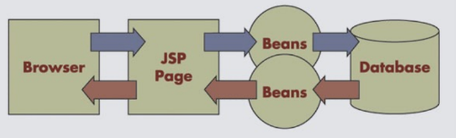
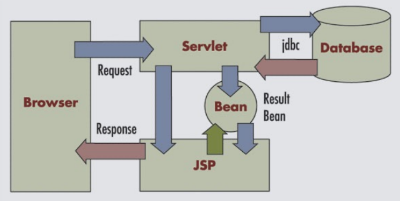
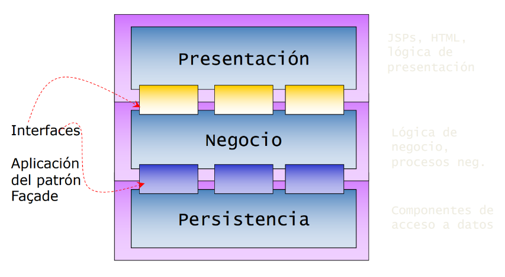
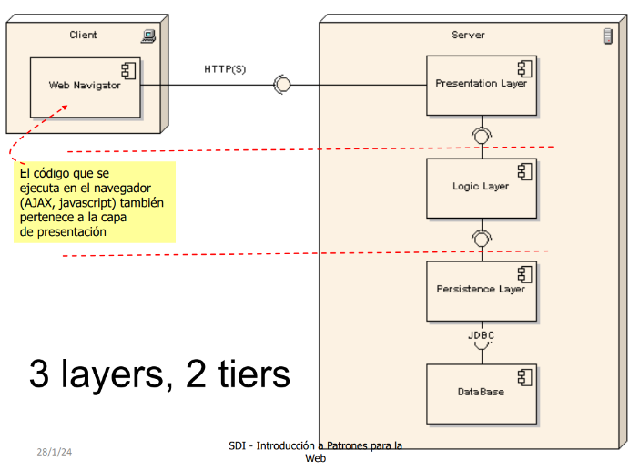
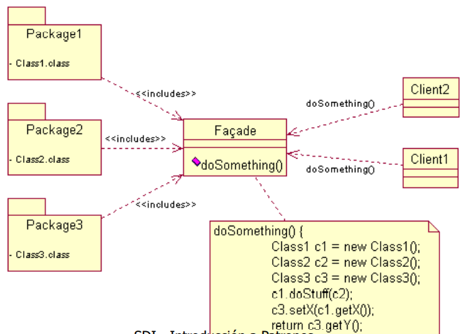
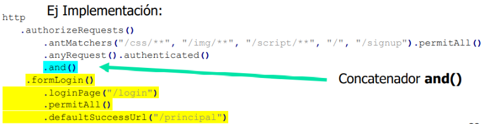
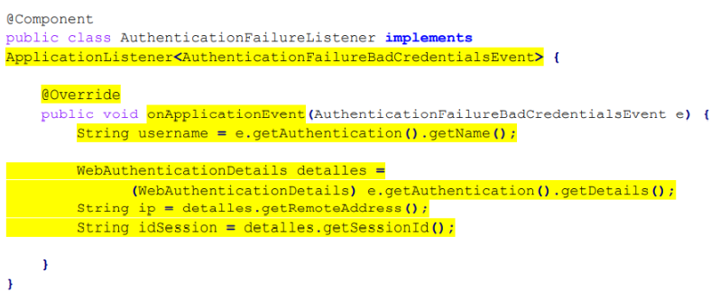
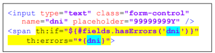
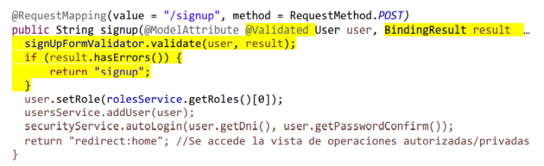
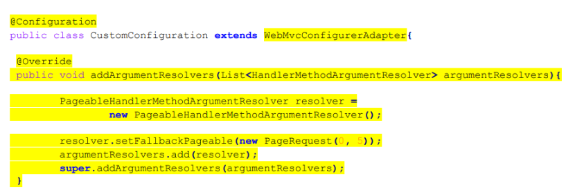

# SDI

| Criterios de calificación | Porcentaje    |
| -                         | -             |
| Teoría                    | 40 %          |
| Práctica                  | 60%           |

Sistemas Distribuidos e Internet es una asignatura enfocada en el desarrollo software avanzado, a través de técnicas clásicas y/o ágiles como pueden ser JEE, Spring Boot, Selenium, NodeJs o servicios REST/SOAP, a parte del uso de patrones de diseño en los que se profundizarán más adelante.

| Información general sobre la asignatura                           |
| -                                                                 |
| CV: https://www.campusvirtual.uniovi.es/course/view.php?id=1313   |

## Tabla de contenidos
- [SDI](#sdi)
  - [Tabla de contenidos](#tabla-de-contenidos)
  - [Plataformas Java](#plataformas-java)
  - [Tema 1 - JEE y Patrones](#tema-1---jee-y-patrones)
    - [Arquitectura Web Básica](#arquitectura-web-básica)
    - [Servlets](#servlets)
    - [Contenedor de servlets/Web container](#contenedor-de-servletsweb-container)
    - [Ciclo de vida](#ciclo-de-vida)
    - [Métodos doGet y doPost](#métodos-doget-y-dopost)
    - [Registro de un servlet](#registro-de-un-servlet)
    - [JSP](#jsp)
      - [Acción useBean](#acción-usebean)
  - [Tema 2: Arquitectura MVC con Spring Boot](#tema-2-arquitectura-mvc-con-spring-boot)
    - [Spring Boot](#spring-boot)
      - [Framework Spring](#framework-spring)
      - [Maven](#maven)
      - [Anotaciones importantes:](#anotaciones-importantes)
    - [Aplicación](#aplicación)
      - [Propiedades](#propiedades)
      - [Elementos principales](#elementos-principales)
    - [Thymeleaf](#thymeleaf)
  - [URLs.](#urls)
  - [Tema 3: Acceso a datos, Autenticación - Control de acceso - Validación en el servidor](#tema-3-acceso-a-datos-autenticación---control-de-acceso---validación-en-el-servidor)
    - [Tipos de patrones:](#tipos-de-patrones)
    - [Introducción a Patrones](#introducción-a-patrones)
      - [Fachada](#fachada)
      - [DTO (Data Transfer Object)](#dto-data-transfer-object)
      - [DAO (Data Access Object)](#dao-data-access-object)
      - [Factoría](#factoría)
  - [Tema 4: Sesión - Roles - Consultas - Búsqueda - Paginación](#tema-4-sesión---roles---consultas---búsqueda---paginación)
    - [Fragmentos](#fragmentos)
      - [Controladores](#controladores)
      - [Cliente](#cliente)
    - [Configuración](#configuración)
      - [@Configuration](#configuration)
      - [@Bean](#bean)
    - [Internacionalización(i18n)](#internacionalizacióni18n)
      - [Configuración](#configuración-1)
      - [Interceptores](#interceptores)
        - [LocaleChangeInterceptor](#localechangeinterceptor)
      - [LocaleResolver](#localeresolver)
      - [Mensajes](#mensajes)
    - [Spring Security](#spring-security)
      - [Autenticación](#autenticación)
      - [Encriptación](#encriptación)
      - [Configuración](#configuración-2)
      - [Autorización (HttpSecurity)](#autorización-httpsecurity)
      - [CSRF (Cross-site request forgery)](#csrf-cross-site-request-forgery)
      - [UserDetails](#userdetails)
      - [UserDetailsService](#userdetailsservice)
      - [Lógica de negocio](#lógica-de-negocio)
      - [Autenticación con Thymeleaf](#autenticación-con-thymeleaf)
      - [Detectar fuerza bruta](#detectar-fuerza-bruta)
    - [Validación de datos](#validación-de-datos)
      - [Validador](#validador)
      - [Mostrar errores](#mostrar-errores)
      - [Agregar el validador](#agregar-el-validador)
      - [ValidationUtils](#validationutils)
    - [Sesión](#sesión)
      - [HttpSession](#httpsession)
      - [Thymeleaf](#thymeleaf-1)
      - [Beans](#beans)
    - [Datos y acciones sensibles](#datos-y-acciones-sensibles)
      - [Implementación](#implementación)
      - [DecisionManager](#decisionmanager)
      - [AccessDecision](#accessdecision)
    - [Paginación](#paginación)
      - [Page](#page)
      - [Controles](#controles)
      - [Configuración](#configuración-3)
    - [Transacciones](#transacciones)
    - [Logging](#logging)
    - [Subida de ficheros](#subida-de-ficheros)
      - [Procesamiento](#procesamiento)
  - [Tema 5: Web testing con Selenium](#tema-5-web-testing-con-selenium)
    - [Tipos de tests:](#tipos-de-tests)
    - [JUnit vs TestNG](#junit-vs-testng)
  - [Tema 6: Desarrollo web con Nodejs 1](#tema-6-desarrollo-web-con-nodejs-1)
  - [Tema 7: Desarrollo web con Nodejs 2](#tema-7-desarrollo-web-con-nodejs-2)
  - [Tema 8: Servicios web REST](#tema-8-servicios-web-rest)
  - [Tema 9: Servicios web SOAP](#tema-9-servicios-web-soap)
  - [Glosario](#glosario)

## Plataformas Java

| Plataformas Java          | Características   |
| -                         | -                 |
| Java Standard Edition     | - Para applets    |
|                           | - VM              |
|                           | - Desarrollo y despliegue de aplicaciones Java en escritorios y servidores |
|                           | - Interfaz de usuario rica, rendimiento, versatilidad, portabilidad y seguridad |
| Java Enterprise Edition   | - Se apoya en SE 
|                           | - Servlets, JSP, JSF, Beans
|                           | - Estándar en software empresarial impulsado por la comunidad <br> - Desarrollo de aplicaciones distribuidas y servicios web |
| Java Micro Edition        | - Proporciona un entorno robusto y flexible para aplicaciones en dispositivos móviles y empotrados
|                           | - Incluye perfiles para dispositivos móviles y televisores |
| JavaFX Script             | - Lenguaje de scripting para JavaFX <br> - Desarrollo de interfaces de usuario ricas para aplicaciones de escritorio, móviles, TV y web |

## Tema 1 - JEE y Patrones

### Arquitectura Web Básica

Un cliente (Navegador) envía una petición de un recurso (URL) a un servidor (Servidor HTTP) y éste le responde vía HTTP

Cuando el navegador solicita una página web, recibe la página y desencadena una petición para cada uno de los
recursos asociados a la misma.

### Servlets

Un servlet es una clase Java que hereda de la clase JEE HTTPServlet y que:

- Acepta peticiones de cualquier método HTTP (get, post, put, delete, head, trace, …)
- Responde también usando el protocolo HTTP
- Se ejecuta dentro de un contenedor de Servlets que a su vez está dentro de un servidor de aplicaciones JEE
- Se trata de un saco “común” a todas las sesiones de usuario 
activas en el servidor

### Contenedor de servlets/Web container

- Un contenedor define un ambiente estandarizado de ejecución que provee servicios
específicos a los servlets. Por ejemplo, dan servicio a las peticiones de los clientes, realizando
un procesamiento y devolviendo el resultado
- Los servlets tienen que cumplir un contrato con el contenedor para obtener sus servicios.
- Los contratos son interfaces Java.Por ejemplo, la interfaz Servlet.

### Ciclo de vida

**INICIALIZACIÓN**: Una única llamada al metodo “init” por parte del contenedor de servlets
public void init(ServletConfig config) throws ServletException. Se pueden recoger unos
parametros concretos con “getInitParameter” de “ServletConfig”. Estos parámetros se
especifican en el descriptor de despliegue de la aplicación: web.xml
**PETICIONES**: Primera petición a init se ejecuta en un thread que invoca a service. El resto de
peticiones se invocan en un nuevo hilo mapeado sobre service
**DESTRUCCIÓN**: Cuando todas las llamadas desde el cliente cesen o un temporizador del
servidor así lo indique. Se deben liberar recursos retenidos desde init() public void destroy()

### Métodos doGet y doPost
Son llamados desde el método service(). Reciben interfaces instanciada:

```java
/*
 * @param req canal de entrada
 * @param resp canal de salida
 */
protected void doGet(HttpServletRequest req, HttpServletResponse resp) 
    throws ServletException, IOException {
        . . .
}
protected void doPost(HttpServletRequest req, HttpServletResponse resp) 
    throws ServletException, IOException {
        . . .
}
```
doGet no cambia el estado, mientras que doPost sí.

### Registro de un servlet

**Opción 1**: Despliegue de web.xml
```xml
<servlet>
    <servlet-name>HolaMundo</servlet-name>
    <servlet-class>uo.sdi.servlet.HolaMundoServlet</servlet-class>
</servlet>
<!-- Standard Action Servlet Mapping -->
<servlet-mapping>
    <servlet-name>HolaMundo</servlet-name>
    <url-pattern>/HolaMundoCordial</url-pattern>
</servlet-mapping>
```

**Opción 2**: Usando anotaciones

```java
@WebServlet(name = "HolaMundo", urlPatterns = { "/HolaMundoCordial" })
public class HolaMundoServlet extends HttpServlet {
    private static final long serialVersionUID = 1L;
    /**
    * @see HttpServlet#HttpServlet()
    */
    public HolaMundoServlet() {
        super();
        // TODO Auto-generated constructor stub
    }
}
```

### JSP

Java Server Pages es una tecnología para crear páginas web dinámicas. Estas páginas están construidas sobre servlets y vienen a resolver el problema de presentación de los mismos.
Permiten generar HTML directamente por código, siendo más adecuados que los Servlets para presentación.

- Tipos de elementos en JSP
  - Scripting: Permiten insertar código java que será ejecutado en el momento de la petición
  - Directivas: Permiten especificar información acerca de la página que permanece constante para todas las peticiones(por ejemplo imports: <% page import=""java.util.Date %>)
  - Acciones: Permiten ejecutar determinadas acciones sobre información que se requiere en el momento de la petición de la JSP(por ejemplo: <jsp: useBean>)

#### Acción useBean
- id
- class: omitible si se proporciona type y beanName
- scope: 4 posibles(de mayor a menor duración)
  - application
  - session
  - request
  - page
- type: tipo de la variable a la que se referirá el objeto
- beanName

## Tema 2: Arquitectura MVC con Spring Boot
- Spring Boot: es una forma fácil de desarrollar aplicaciones en Spring.

### Spring Boot

Spring Boot aumenta la agilidad del desarrollo de aplciaciones en spring.
- Provee opciones de configuración por defecto
- uso opcional de POMS
- Evita generación de código y configuraciones XML presentes en Spring

#### Framework Spring
- Aplicaciones basadas en el patrón MVC
- Soporte completo al desarrollo de ap,licaciones empresariales basadas en POJOs
- Sistema de inyección de dependencias basadas en el IoC container (inversion of Control)
  - Menor consumo de recursos que los EJB
- Gran cantidad de módilos con funcionalidad reutilizable
- Traducción de instrucciones específicas a genéricas

#### Maven
Dominio: http://maven.apache.org
- Permite especificar procesos para muchas acciones 
relativas al desarrollo de software
   Validaciones, compilación, despliegue, pruebas, etc.
- Gestión de dependencias / artefactos (“superlibrerias”) 
  
SpringBoot utiliza Maven con ficheros POM

#### Anotaciones importantes:
- **@SpringBootAplication**: 
  - Se pone en la clase principal
  - Fusiona tres anotaciones:
    - **@Configuration**: puede definir elementos de configuración
    - **@EnableAutoConfiguration**: habilita auto-configuración
      - El atributo exclude permite excluir partes de la autoconfiguración y que dicha parte no sea aplicada.
    - **@ComponentScan**: se escanea la aplicación en busca de componentes implementados
      - Al detectar esos componentes los registra como Beans
- **@RequestMaping**
  - Usado en métodos de controladores
  - Indica que un método responderá a peticiones
  - value: especifica la URL
  - method: especifica el tipo de petición HTTP
    - RequestMethod.GET (por defecto)
    - RequestMethos.POST
- **@RequestParam**
  - Usado para añadir parámetros (por defecto obligatorios) a las peticiones 
  - Con el atributo required = false, se pueden hacer opcionales
  - Con el atributo value se puede poner un valor por defecto
- **@ModelAttribute**:
  - Construye automáticamente un objeto en base a los parámetros recibidos
  - La clase utilizada debe definir:
    - Constructor sin parámetros
    - Getters para los atributos
  - Se completan los atributos en los que haya coincidencia de nombres
- **@ResponseBody**
  - Hace que una respuesta sea un objeto, en lugar de una plantilla
  - Comúnmente usado en pruebas
- **@RestController**
  - Controlador específico que añade **@ResponseBody** a todos sus métodos
  - Comúnmente usado en pruebas
- **@Autowired**
  - Usada en atributos
  - Permite inyectar una dependencia, sin necesidad de configuración adicional
  - Es una alternativa a instanciar un objeto
- **@PostConstruct**
  - Especifica que un método se ejecutará una vez construido el componente
- **@PreDestroy**
  - Permite especificar que un método se ejecutará justo antes de destruir el componente
- **@Qualifier**
  - Permite inyectar una implementación de una interfaz junto con **@Autowired**
- **@RequestScope**
  - Ámbito por cada petición HTTP
- **@SessionScope** 
  - Ámbito cada sesión HTTP / cliente/navegador.
- **@Scope("prototype")** 
  - Ámbito por cada clase en la que se inyecta el componente

### Aplicación
#### Propiedades
- El fichero **application.properties** permite modificar las propiedades por defecto / definir nuevas
- También pueden definirse con:
  - Clases, al inicial la aplicación
  - Anotaciones específicas
  - **application.yml**
  - Parámetros en línea de comandos al ejecutar la aplicación

#### Elementos principales
- Componentes(**@Component**): Se procesan internamente como Beans
  - Controladores (**@Controller**)
    - Procesan peticiones realizadas por clientes
    - Pueden invocar a la lógica de negocio (servicios) y generar una respuesta
    - Retornan la ruta para localizar una plantilla
  - Servicios(**@Service**)
    - Capa de lógica de negocio (business)
    - Suelen acceder a repositorios
    - Ámbito Singleton por defecto
  - Repositorios(**@Repository**)
    - Acceden a bases de datos
    - Se suelen inyectar con **@Autowired**
  - Configuraciones(**@Configuration**)
- Entidades: Clases que representan las entidades con las que trabaja la aplicación.
- Vistas: Documentos que pueden ser utilizados para componer respuestas de forma más sencilla o eficiente.

### Thymeleaf
- Las plantillas se almacenan por defecto en la carpeta **/templates**
- La plantilla tiene acceso a los atributos del modelo
- El operador @ ofrece funcionalidad para gestión de parámetros en 
URLs.
- 

## Tema 3: Acceso a datos, Autenticación - Control de acceso - Validación en el servidor

### Tipos de patrones:
- Arquitectónicos: Relacionados con el diseño a gran escala y de granularidad gruesa. (Capas)
- Diseño: Relacionados con el diseño de objetos y frameworks de pequeña y mediana escala. (Fachada)
- Estilos: Soluciones de diseño de bajo nivel orientadas a la implementación o al lenguaje (Singleton)

### Introducción a Patrones

**Model-1.5**: JSPs para presentación y control, y JavaBeans para la lógica.


**Model-2**: Model-View-Controller = JavaBeans-JSPs-Servlet



**Modelo N-capas**: Modelo de Brown n-capas, contiene un patrón fachada entre capas, no permitiendo dependencias a través de estas. 

Layers y Tiers:
- Layer: capa arquitectónica (presentación, lógica, persistencia...)
- Tier: capa física (servidor web, servidor de aplicaciones, servidor BBDD)



En la asignatura se usarán los siguientes patrones

| Presentación  | Negocio   | Persistencia  |
| -             | -         | -             |
| MVC           | Fachada   | DAO           |
|               | Factoría  | DTO           |
|               |           | Factoría      |
|               |           | Active Record |

#### Fachada
- Interfaz único y simplificado de los servicios más generales de un subsistema.



#### DTO (Data Transfer Object)
- Utilizado para transferir datos entre subsistemas
- Se utilizan a menudo en combinación con objetos DAO (persistencia) para obtener datos de una base de datos

#### DAO (Data Access Object)
- Ofrece operaciones CRUD para cada objeto persistente del dominio

#### Factoría
- Una factoría es un objeto encargado de la creación de 
otros objetos.
- El cliente no conoce el tipo concreto del objeto a crear.


## Tema 4: Sesión - Roles - Consultas - Búsqueda - Paginación

### Fragmentos
- El uso por defecto de Thymeleaf consiste en retornar una vista correspondiente a una plantilla

- Para ganar fluidez y eficiencia en ocasiones no se retorna una plantilla/página completa
- Una alternativa es retornar una/varias partes de fragmentos de la plantilla/página

- Se suele dar un id al fragmento

#### Controladores
- Referencian frangmentos con \<ruta plantilla> :: \<nombre fragmento>

#### Cliente
- Con JQuery: $(\<selector>).load(\<url>)

### Configuración
- Spring Boot incluye una genérica por defecto.

#### @Configuration
- Las clases base de configuración del framework se pueden utilizar sobreescribiendo métodos o utilizando métodos definidos en la clase de configuración.

#### @Bean
- Muchas implementan Beans.
- Definen:
  - Funcionalidad necesaria para la propia configuración
  - Funcionalidad común que será utilizada en otras partes de la aplicación
- Se registran al iniciar la aplicación

### Internacionalización(i18n)

#### Configuración
- Hacemos uso de **WebMvcConfigurerAdapter**, una de las clases más genéricas de configuración para añadir **interceptores**

#### Interceptores
- Servlets que ...
- Suelen(o igual siempre) heredar de un interceptor básico(**HandlerInterceptorAdapter**).
- Retornan un Bean.
- El Bean se registra a través del método **addInterceptors()** 
  
##### LocaleChangeInterceptor
- **LocaleChangeInterceptor** es un interceptor *implementado en el framework* relativo a la internacionalización.
- Se define un parámetro en la instancia(p.e: "lang")
  
#### LocaleResolver
- Es un objeto del framework que permite hacer cambios automáticos de idioma.
- Basado en sesiones, cookies y cabeceras accept-language
  
#### Mensajes
- Las cadenas de texto internacionalizadas se definen en ficheros de propiedades(.properties)
- Desde **Thymeleaf** usamos las claves para obtener los mensajes.

### Spring Security
#### Autenticación
- Proceso para validar la identidad del usuario
- Dependencia **spring-boot-starter-security**

#### Encriptación
- **BCryptPasswordEncoder** soporta la encriptación de forma ágil
  - Puede usarse como un bean

#### Configuración
- Hay que hacer una clase que herede de **WebSecurityConfigurerAdapter**
  - Debe incluir las anotaciones:
    - **@Configuration**
    - **@EnableWebSecurity**

#### Autorización (HttpSecurity)
- Sobreesceibimos el método **configure(HttpSecurity http)**
- Permite configurar el sistema de autorización entre otros aspectos.
- Definición de autorizaciones:
  - Se basa en un **orden de prioridad**
  - **authorizeRequests()**: función principañ
    - Dentro se anidan **antMatchers** y **anyRequest**
      - antMatchers("urls"): especifica URL/S
        - Para cada antMatchers se especifica la autorización:
          - **permitAll()**: cualquier petición puede acceder
          - **authenticated()**: cualquier usuario autenticado puede acceder (independientemente del role)
          - **hasAuthority(“Nombres de Roles”)**: para acceder el usuario autenticado debe tener el **Role** especificado
- Formulario de autenticación / login
  - Función **formLogin()**, no se incluye en **authorizeRequests()**, pero se concatena con un **and()**
  
  - Dentro se anidan:
    - **loginPage(“URL”)**: URL del formulario de login
    - Tipo de autenticación (permitAll(), autenticated() …)
    - **defaultSucessUrl +(“URL”)**: URL que se carga después de la autenticación valida
    - **failureUrl(“URL")**: URL de carga en caso de fallo en la autenticación.
    - **failureHandler(authenticationFailureHandler())**: Manejador que captura el evento de fallo en la autenticación.
- Sistema **logout**
  - Función **logout()**
  - Se concatena con **and()**
  - Dentro se anidan entre otros:
    - Tipo de autenticación (permitAll(), autenticated() …)
    - **logoutSucessUrl(“URL”)**: redirección después de cerrar sesión

#### CSRF (Cross-site request forgery)
- Configuración de seguridad activada por defecto
- Se puede desactivar con **disable()**, concatenandose con un **and()**
- Se incluyen tokens como hidden input para mayor seguridad

#### UserDetails
- Identificador único
- password
- Role/s

#### UserDetailsService
- Servicio encargado de crear los UserDetails
- Obtiene el usuario asociado al username
- Crea una colección **GrantedAuthority**
- Crea un objeto de tipo User Details y lo retorna

#### Lógica de negocio
- **getContext().getAuthentication()** retorna el objeto **Authentication**
- Authentication contiene la información del usuario autenticado y permite desautenticarlo entre otras cosas

#### Autenticación con Thymeleaf
- **sec:authentication**: información sobre el cliente autenticado.
- **sec:authorize**: información sobre autorizaciones.

#### Detectar fuerza bruta


### Validación de datos
#### Validador
- Se recomienda implementar un validator por proceso/formulario
- Tienen la función **validate(Object, Errors)**
  - errors.**rejectValue(<clave_del_campo> ,<mensaje_de_error> )**

#### Mostrar errores


#### Agregar el validador


#### ValidationUtils
- Clase estática de utilidades de validación
  - **rejectIfEmpty(errors, <clave_del_campo>’, mensaje error)**
  - **rejectIfEmptyOrWhiteSpace (errors, <clave_del_campo>’, mensaje error)**

### Sesión
- La aplicación crea una sesión para cada nuevo cliente
- Se identifica con una ID, la cual se envía en una cookie
- Puede almacenar/recuperar datos de las sesiones
- Se destruyen automáticamente tran un tiempo de inactividad, también pueden destruirse por código
  
#### HttpSession
- Permite acceder a la sesión
- Funciona como una tabla Hash

#### Thymeleaf
- Las plantillas pueden acceder a la sesión

#### Beans
- Por defecto se gestionan como Singleton.
- Con @SessionScope se puede modificar

### Datos y acciones sensibles
- Las aplicaciones web suelenn ser multiusuario y de acceso público
- Problema de exposición de datos sensibles
  
#### Implementación
- URLs con datos/acciones sensibles solo pueden ser utilizadas por cierto usuarios

#### DecisionManager
- Especialmente útil cuando las peticiones no pasan por un controlador
- WebSecurityConfigurerAdapter declara diferentes políticas de acceso
  - **Authenticated()** y **hasAuthority(role)** permiten el acceso a usuarios autenticados o con roles
  - **accessDecisionManager(manager)** crear políticas de acceso especificas

#### AccessDecision
- Las comprobaciones de acceso se realiza en una clase que implementa **AccessDecisionVoter<FilterInvocation>**
  - El retorno de **vote(authentication,filter,attributes)** determina si habrá acceso
    - **ACCESS_DENIED**
    - **ACCESS_GRANTED**
    - **ACCESS_ABSTAIN**
- Requiere sobrescribir los métodos supports, retornado true.
- Para aplicar los AccessDecisionVoter en la configuración de seguridad:
  - Se agrupan los AccessDecisionVoter(1-N) en un objeto **AccessDecisionManager**
  - Se incluye la política .accessDecisionManager(manager) para un conjunto de URLs
    - El decissionManager se agrega después de una política básica (Ej, permitAll())

### Paginación
- Cargar muchos elementos en una misma página es costoso y perjudica la experiencia de usuario

#### Page<E>
- Objeto del sistema de paginación
- Similar a una List, pero incluye más información relativa a la paginación	
- Los repositorios retornarán este objeto
  - También en servicios y controladores que manejen paginación
- Los métodos deben recibir un parametro adicional **Pageable**

#### Controles
- La vista debe ofrecer navegación
  - Se implementa en un fragmento
- Se recomienda al menos:
  - Página actual
  - Páginas cercanas
  - Primera y última

#### Configuración
- Se puede modificar la paginación mediante la configuración:


### Transacciones
- La anotación **@Transactional** declara el uso de transacciones en un método o componente

### Logging
- Consiste en guardar información sobre eventos relativas a la aplicación

### Subida de ficheros
#### Procesamiento
- El controlador debe recibir el parámetro de tipo **File**
  - Se puede utilizar el tipo **MultipartFile**

## Tema 5: Web testing con Selenium
### Tipos de tests:
- Funcional: Prueba de todos los enlaces web, conexiones, envío de datos...
- Usabilidad: Miden características de la interacción computador-máquina.
- Interface: Conexiones entre servidores.
- Compatibilidad: En navegadores, SSOO, móviles...
- Rendimiento:
  - Pruebas de carga: volumen de usuarios/conexiones, datos, conexiones...
  - Pruebas de estrés: Exponer al sistema a valores límite de demanda de recursos.
- Seguridad:
  - Uso de URLs sin identificarse, con otros roles, ...
  
### JUnit vs TestNG
- Similitudes:
  - OpenSource • TestNG fue inspirado en Junit • Son las librerías de testing más populares (ambas en el top 20).
  - Junit presente en el 62% de los proyectos Java y TestNG en el 6%.
- Diferencias:
  - JUnit: Más es más maduro y presenta una comunidad mucho mayor. 
  - TestNG: Más potente.

## Tema 6: Desarrollo web con Nodejs 1

## Tema 7: Desarrollo web con Nodejs 2


## Tema 8: Servicios web REST
## Tema 9: Servicios web SOAP
## Glosario

| Término | Definición |
|---------|------------|
| URL     | Unique Resource Locator. |
| HTTP    | HyperText Transfer Protocol. protocolo de aplicación utilizado para el intercambio de información en la Web mediante el paso de mensajes. |
| Patrón  | 
| Spring  | Framework basado en JEE que usa el patrón MVC para el desarrollo de aplicaciones  web. Usa un modelo POJO
| POJO    | Modelo basado en clases planas sin herencia de otras 
| Interceptores | Servlets que ...


